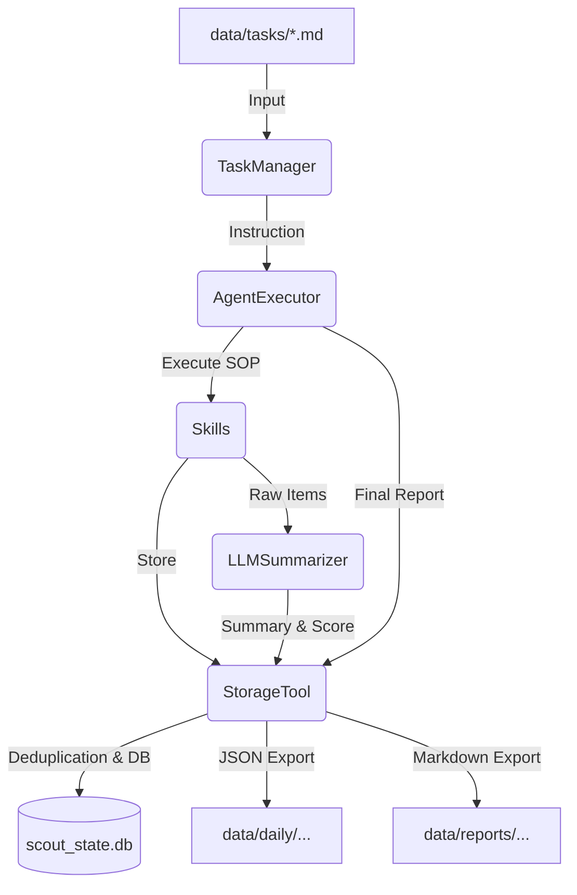

# Scout 详细技术设计文档 (Technical Design)

本文档旨在通过详细的类定义、数据结构流转及核心逻辑说明，指导 AI 或开发者完整还原 Scout 系统。

## 1. 系统核心架构
Scout 采用“声明式配置 -> 智能化编译 -> 动态化执行”的流式架构。

## 2. 核心类与接口标准

### 2.1 数据模型: `ScrapedItem`
所有采集器必须返回以此为基准的结构体（Pydantic 或 NamedTuple）。
- `id`: 字符串，全局唯一标识（通常是 URL 的 hash）。
- `source`: 来源类型（arxiv, x, stock_news 等）。
- `title`: 标题。
- `url`: 原始链接。
- `content`: 原始内容全文。
- `publish_time`: ISO 格式的时间字符串。

### 2.2 采集器接口: `BaseCollector`
- `fetch_data() -> List[ScrapedItem]`: 执行具体的 API 调用或网页解析。

### 2.3 状态管理器: `StateManager` (SQLite 实现)
负责去重、反馈记录及执行报告存储。
- **Schema `scraped_items`**: `id (PK), task_id (TEXT), source, title, url, publish_time, score, summary, reason, processed_at`
- **Schema `execution_reports`**: `task_id (TEXT), date (TEXT), metadata_json (TEXT), summary_report (TEXT), created_at`
  - *注：此表取代了已废弃的 `daily_summaries` 表，实现了一站式的报告管理。*

### 2.4 配置编辑器: `ConfigAgent`
利用 LLM 将 `task.md` 转换为 XML 执行计划。转换逻辑不仅是格式转换，还包含“逻辑对齐”（如将时间描述转换为具体的 API Filter 语法）。

## 3. 核心业务流程
- **定时调度**：`main_web.py` 启动时读取 `data/tasks/` 下所有 `.md` 文件的 `cron` 字段，注册到 `APScheduler`。
- **采集闭环**：
  1. `run_collection_job` 接收 `task_name`。
  2. 调用 `ConfigAgent` 生成/加载 `plan.xml`。
  3. 按照 XML 里的 `<sources>` 列表循环执行。
  4. 每条数据调用 `summarizer.evaluate_and_summarize`。
  5. 仅当 `llm_result` 存在（即评分过线）时，执行落盘 (`DataExporter`) 和汇总 (`daily_report`)。

## 4. 前端交互规范
- 通道：`/api/tasks/chat` 提供 NLP 转 Markdown 的能力。
- 界面：`config.html` 采用分栏设计。左侧为文件列表，右侧为 Markdown 编辑器。点击保存时更新 `.md` 文件并自动触发 `ConfigAgent` 刷新 `plan.xml`。
